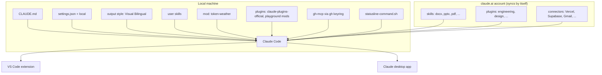
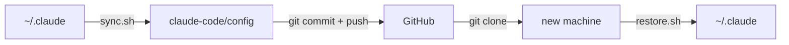

# Claude Code config

My personal Claude Code setup: global instructions, settings, skills, output styles, a mod, the plugin list, and MCP servers.

## Layout

```
claude-code/
├── sync.sh                     # ~/.claude -> config/
├── restore.sh                  # config/ -> ~/.claude
└── config/
    ├── CLAUDE.md               # global instructions
    ├── settings.json           # permissions, plugins, autoMode, status line
    ├── settings.local.json     # local overrides
    ├── statusline-command.sh   # status line script
    ├── github-mcp-headers.sh   # gh-mcp auth headers from the gh keyring
    ├── mcp-servers.json        # mcpServers from ~/.claude.json (env/headers redacted)
    ├── output-styles/          # Visual Bilingual
    ├── skills/                 # user skills
    ├── mods/token-weather/     # local plugin: context and rate-limit band
    ├── plugins/                # installed plugins and marketplaces (reference)
    └── external/               # whitelist extracts of settings outside ~/.claude
        ├── claude-json-prefs.json      # ~/.claude.json prefs + per-project MCP on/off
        ├── claude-ai-synced.json       # account skills, plugins, connectors (names)
        ├── agents-skill-sources.json   # skills CLI sources (~/.agents)
        ├── vscode-settings.json        # claudeCode.* VS Code settings
        ├── desktop-preferences.json    # Claude desktop app preferences
        └── project-settings.json       # .claude/settings in non-git folders
```

## Setup map



## Workflow



### Back up

```bash
claude-code/sync.sh     # copy the live setup into config/, then scan for secrets
git diff                # review
git commit -am "Sync Claude Code config" && git push
```

`sync.sh` never writes to `~/.claude`. It redacts MCP `env`/`headers` values and credential-like `env` values in settings. It stops if the secret scan finds a match.

### Restore

```bash
git clone https://github.com/kelvinlee97/kelvinlee97 ~/code/kelvinlee97
~/code/kelvinlee97/claude-code/restore.sh
```

`restore.sh` moves each existing target to `<target>.bak-<timestamp>` before it copies the new file. It then prints the manual steps for plugins and MCP servers.

## Shell setup

Add this line to `~/.zshrc`. It reads the key from the macOS keychain at shell start, so no key is stored on disk.

```bash
# weread-skills API key from the macOS keychain
WEREAD_API_KEY="$(security find-generic-password -a "$USER" -s weread -w 2>/dev/null)"
```

`gh-mcp` does not need a shell variable. `github-mcp-headers.sh` reads the token from the `gh` keyring when Claude Code connects.

## Dependencies

| Tool | Used by |
|---|---|
| `gh` (signed in) | `github-mcp-headers.sh`, `ci-automerge` skill |
| `jq` | `statusline-command.sh` |
| `python3`, `rsync` | `sync.sh`, `restore.sh` |
| `node` / `npx` | `skills` CLI |
| Ghostty | `deepLinkTerminal` preference |

## Not in this repo

This repo is public, so these items are not copied:

| Item | Reason |
|---|---|
| Auto memory (`projects/*/memory`) | private project notes |
| `weread-skills` | third-party skill with no license |
| `skills/synced/` | claude.ai syncs these skills automatically |
| Plugin cache and marketplaces | `/plugin install` downloads them again |
| `blast-radius` plugin | third-party, from `anthropics/claude-code-playground` |
| Transcripts, `history.jsonl`, `security/`, `telemetry/` | private runtime state |
| Full `~/.claude.json` | account and OAuth state; only a whitelist goes to `external/` |
| Project `CLAUDE.md` and `.claude/` in git repos | each repo already tracks its own files |
| Cloud routines | all current routines are one-time PR check-ins that already ran |

## Notes

- `settings.json` and `mcp-servers.json` contain absolute paths under `/Users/kelvin`. Edit them if the home directory differs.
- The `claude-code-playground-mods` marketplace needs a clone of `anthropics/claude-code-playground` at `~/code/claude-code-playground`.
